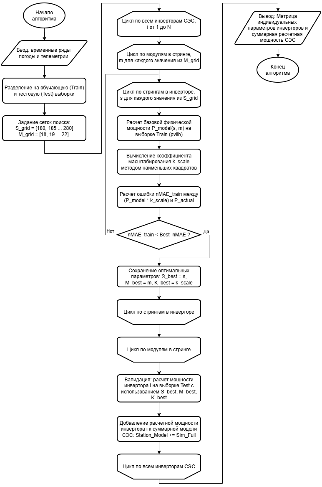
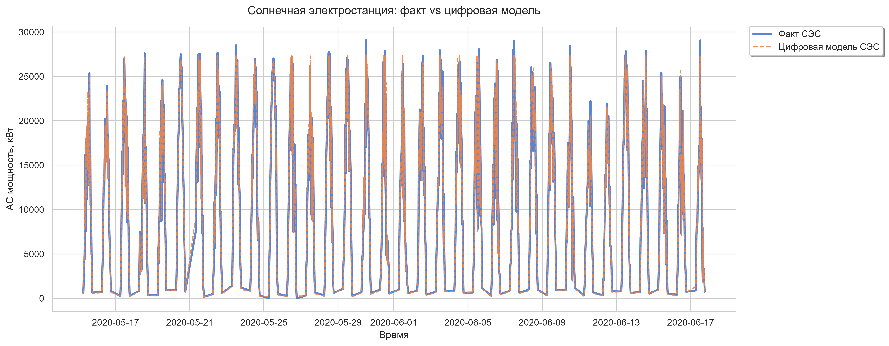
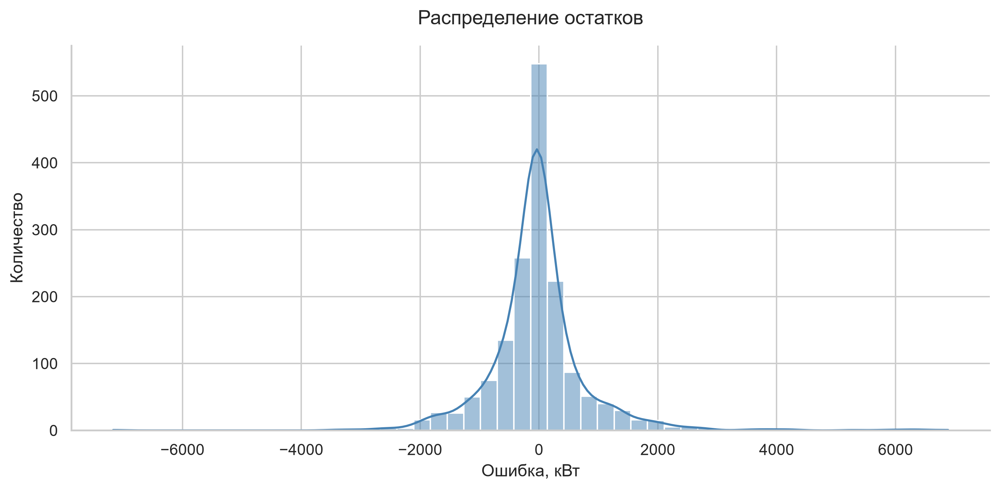

# Grey-Box Digital Model (Solar Power Plant)

## О проекте
Цифровая модель промышленной СЭС (22 МВт) для формирования идеальной базовой линии генерации. Разработана для последующей интеграции алгоритмов предиктивного обслуживания и поиска аномалий.

## Проблема
Реальные данные телеметрии (SCADA) содержат ошибки, а точная проектная документация (схемы кабелей, паспорта оборудования) отсутствует или устарела. Чистые физические модели (White-box) не работают, а глубокие нейросети (Black-box) лишены физической интерпретируемости и требуют многолетних данных.

## Решение
Реализован гибридный **Grey-box** подход:
1. **White-box ядро (pvlib):** Детерминированная физика (модель Де Сото, Sandia Inverter Model).
2. **Data-Driven слой:** Алгоритм 2D Grid Search + МНК для структурно-параметрической идентификации неизвестных параметров оборудования (топология стрингов) и компенсации эксплуатационных потерь (деградация, КПД).

## Бизнес-ценность 
Модель способна калиброваться на коротких участках данных (Train 70% / Test 30%). Ошибка на новых данных составляет **nMAE = 2,3% (R² = 0,988)**. Полученные остатки имеют форму нормального шума около нуля.

## Стек технологий
`Python`, `pvlib` (Computational Physics), `pandas`, `scikit-learn`, `System Engineering (ГОСТ Р 57700.37)`

## Алгоритм структурно-параметрической идентификации
Поскольку точная проектная документация СЭС отсутствовала , ядро проекта составляет **алгоритм структурно-параметрической идентификации** (автоматизированный реверс-инжиниринг физической топологии объекта по его телеметрии).

*Логика работы алгоритма:*
1. **Изоляция данных:** Жесткое разделение телеметрии на `Train` (70%) и `Test` (30%) для исключения утечки данных.
2. **2D Grid Search:** Итеративный перебор структурных параметров массива (число стрингов и количество модулей в стринге).
3. **Синтез Grey-box:** Для каждой структурной гипотезы алгоритм:
   * Рассчитывает идеальную физическую генерацию $P_{model}$ через библиотеку `pvlib` (White-box).
   * Вычисляет адаптивный коэффициент $k_{scale}$ методом наименьших квадратов (МНК) для компенсации реальных эксплуатационных потерь.
4. **Оптимизация:** Выбор конфигурации, минимизирующей Loss-функцию (nMAE) строго на обучающей выборке.
5. **Валидация:** Проверка найденных параметров на отложенных тестовых данных.

  

## Исходные данные (Dataset)

В проекте используются открытые ретроспективные данные телеметрии с реальной индийской солнечной электростанции. Данные включают показания инверторов и локальной метеостанции с дискретностью 15 минут за период 34 дня.

**Источник:** [Solar Power Generation Data (Kaggle)](https://www.kaggle.com/datasets/anikannal/solar-power-generation-data)

**Структура необходимых файлов для запуска:**
Для локального запуска проекта скачайте датасет по ссылке выше и поместите следующие файлы в директорию `data/` в корне репозитория:
* `Plant_1_Generation_Data.csv` — телеметрия активной и постоянной мощности инверторов.
* `Plant_1_Weather_Sensor_Data.csv` — метеорологические данные (GHI, температура модулей, температура воздуха).

## Результаты (Валидация)
Алгоритм продемонстрировал высокую обобщающую способность. Модель не переобучена (разница ошибок между Train и Test составляет менее 0,02%).

### 1. Наложение расчетной модели на фактические данные
Оранжевая пунктирная линия (Grey-box модель) точно повторяет все стохастические пики и провалы синей линии (Факт SCADA). Модель корректно отрабатывает влияние облачности и температурные коэффициенты.

  

### 2. Анализ распределения остатков
Гистограмма невязки (Модель минус Факт) имеет форму, близкую к нормальному гауссовскому распределению с математическим ожиданием около нуля. 

**Вывод:** Систематические ошибки в модели отсутствуют. Резкие выбросы из этого распределения будут однозначно сигнализировать о физической поломке оборудования или ошибках датчиков телеметрии.

  

